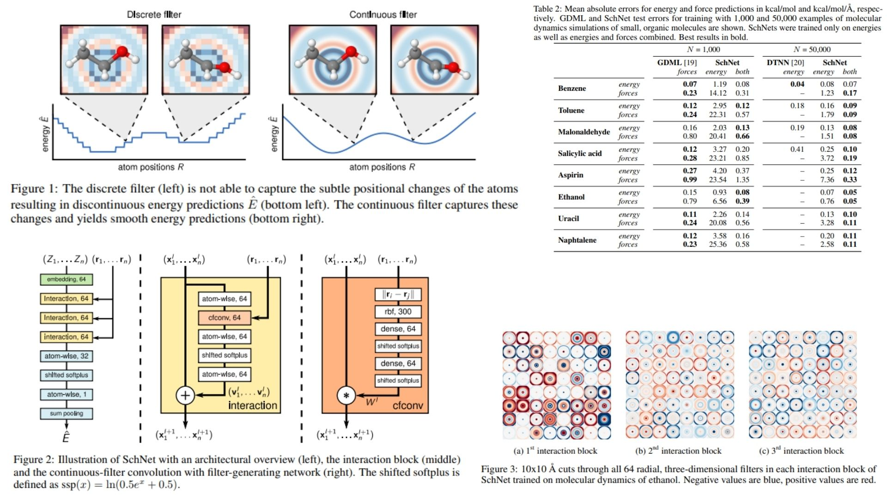

# ⚛️ Energy-SchNet-Replication — Energy-Only SchNet Model

This repository provides a **forward-only PyTorch replication** of the  
**SchNet architecture** for molecular energy prediction.

The goal is **architectural and mathematical fidelity**, not benchmark optimization.  
It reproduces the core SchNet formulation — **atom embeddings, continuous-filter convolutions (cfconv), and atom-wise energy pooling** — in minimal, readable code without force prediction or dataset-specific training.

Focus is on understanding how:

- Atom-wise features propagate through interaction blocks 🔄  
- Continuous-filter convolutions model local correlations based on **interatomic distances**  
- Residual updates construct a smooth potential energy surface 🌀  

Paper reference: [SchNet: A Continuous-Filter Convolutional Neural Network for Modeling Quantum Interactions](https://arxiv.org/abs/1706.08566)

---

## Overview — Molecular Energy Modeling ✦



> Molecular energies arise from atom types, positions, and their quantum interactions.

SchNet integrates:

- Atom embeddings based on type  
- Continuous-filter convolutions for interatomic interactions  
- Residual interaction blocks  
- Atom-wise pooling into total energy  

This produces **smooth, rotationally invariant energy predictions**.

---

## Molecular Representation ⚗︎

A molecule is represented by:

$$
R = (r_1, r_2, ..., r_n), \quad Z = (Z_1, Z_2, ..., Z_n)
$$

with atom features:

$$
X^0_i = a_{Z_i} \in \mathbb{R}^{F}
$$

where $a_{Z_i}$ is the learned embedding for atom type $Z_i$.

Interatomic distances are encoded via radial basis functions:

$$
e_k(r_i - r_j) = \exp(-\gamma_k (||r_i - r_j|| - \mu_k)^2)
$$

These serve as input to the **cfconv filter-generating networks**.

---

## Interaction Blocks 🔄

Each interaction block updates atom representations:

$$
x_i^{l+1} = x_i^l + v_i^l
$$

with residual updates:

$$
v_i^l = \text{AtomWise} \big( \text{cfconv}(x^l, e_{ij}) \big)
$$

Sequential updates allow **many-body representations** while keeping **rotational invariance**.

---

## Energy Readout Phase 🜁

Atom-wise features are pooled into total molecular energy:

$$
\hat{E} = \sum_i \text{AtomWiseReadout}(x_i^L)
$$

This yields a **single scalar energy** per molecule, smooth and physically meaningful.

---

## Why Energy-Only SchNet Matters 🧪

- Focuses on reproducing **energy predictions** without force computation  
- Demonstrates continuous-filter convolutions for arbitrary atomic positions  
- Maintains **energy-conserving, rotationally invariant representations**  
- Minimal, readable implementation for educational and replication purposes  

---

## Repository Structure 🗂

```bash
Energy-SchNet-Replication/
├── src/
│
│   ├── schnet/
│   │   ├── cfconv.py                  # Continuous-filter convolution layer
│   │   ├── interaction_block.py       # Atom-wise residual + cfconv update
│   │   ├── atom_embedding.py          # Atom type -> embedding vector
│   │   ├── readout.py                 # Atom features -> total molecular energy
│   │   └── schnet_model.py            # Forward pass: embedding -> interactions -> pooling -> energy
│
│   ├── chemistry/
│   │   ├── atom_features.py           # Atom type embeddings, optional charge
│   │   ├── distance_matrix.py         # Pairwise interatomic distances
│   │   └── graph_builder.py           # Molecule -> atom features + positions
│
│   ├── config.py                      # Hyperparameters: n_layers, n_features, rbf params, etc.
│   └── pipeline.py                    # Data loader, forward pass, energy output, minimal logging
│
├── images/
│   └── figmix.jpg                      # Model overview figure
│
├── requirements.txt
└── README.md
```
---


## 🔗 Feedback

For questions or feedback, contact: [barkin.adiguzel@gmail.com](mailto:barkin.adiguzel@gmail.com)
